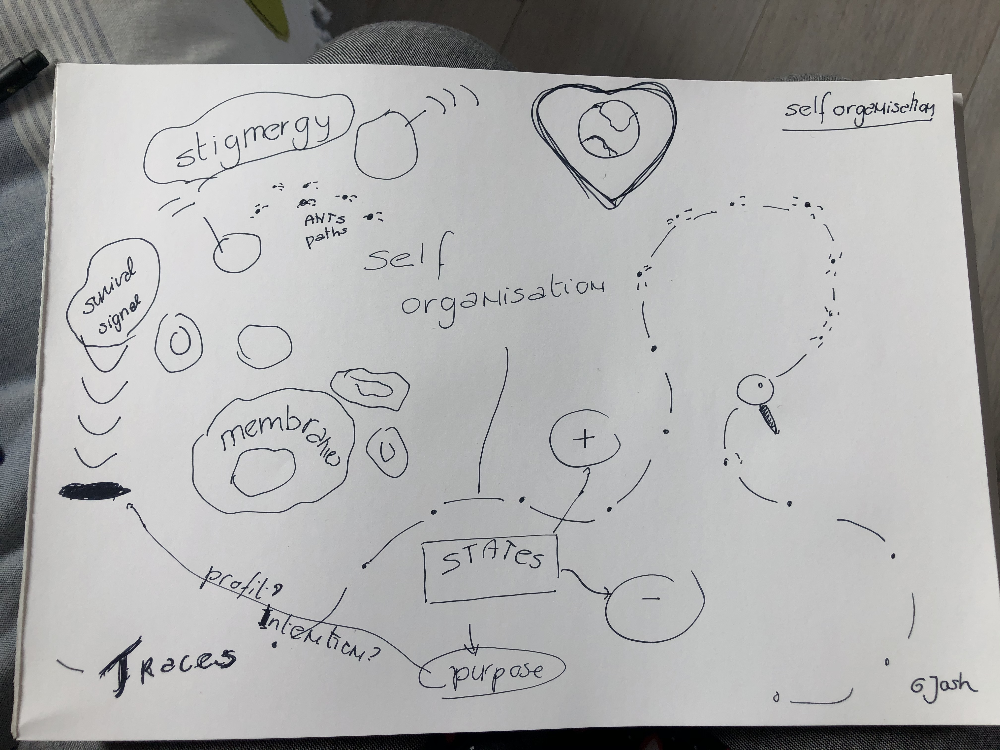

Cocreation of the unconference schedule followed by a framing of the notion of self organisation initiated by Josh followed by discussion on the topic

<iframe width="560" height="315" src="https://www.youtube.com/embed/6RARna-6-kk" frameborder="0" allow="accelerometer; autoplay; clipboard-write; encrypted-media; gyroscope; picture-in-picture" allowfullscreen></iframe>